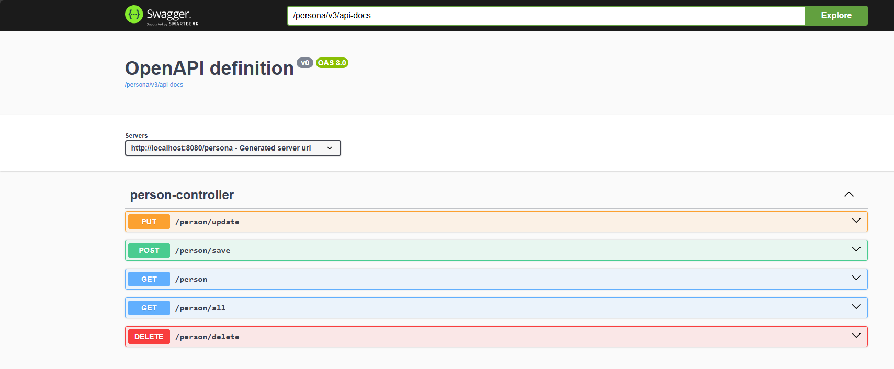
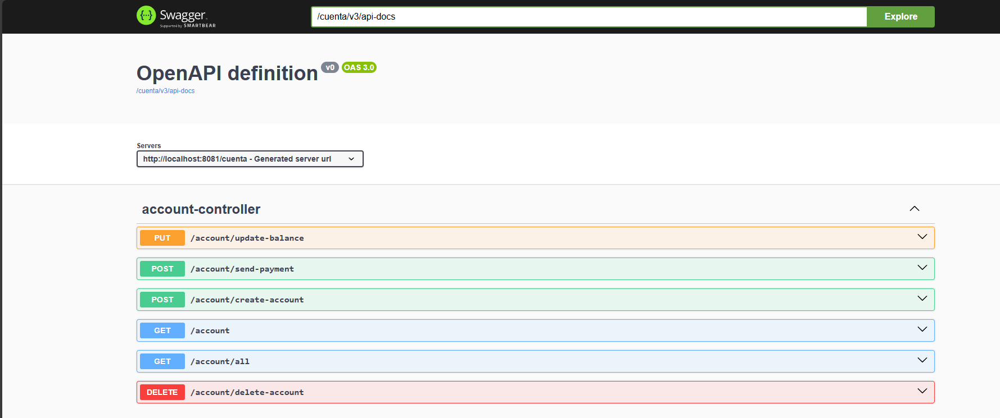
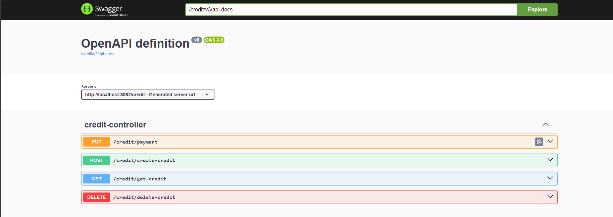

# Descripción del proyecto

Este proyecto es una aplicación de microservicios que simula un sistema de créditos. La aplicación está compuesta por tres microservicios: Persona, Cuenta y Crédito. 

Persona es el microservicio independiente que se encarga de gestionar la información de los clientes. El microservicio cuenta se encarga de traer la información de los clientes y agregarles una cuenta. Por último, el microservicio crédito el el encargado de  llamar a cuenta y hacer todas las validaciones y lógica de negocios para otorgar un crédito.

## CRUD Persona

[Swagger UI Persona - URL](http://localhost:8080/persona/swagger-ui/index.html#/)

## CRUD Cuenta

[Swagger UI Cuenta - URL](http://localhost:8081/cuenta/swagger-ui/index.html#/)

## CRUD Crédito

[Swagger UI Crédito - URL](http://localhost:8082/credit/swagger-ui/index.html#/)

## Dependencias utilizadas:

- Spring Data JPA
- PostgreSQL Driver
- Spring Web
- Spring Test
- OpenFeign
- Spring Cloud Eureka Server
- Spring Cloud Eureka Client
- Lombok